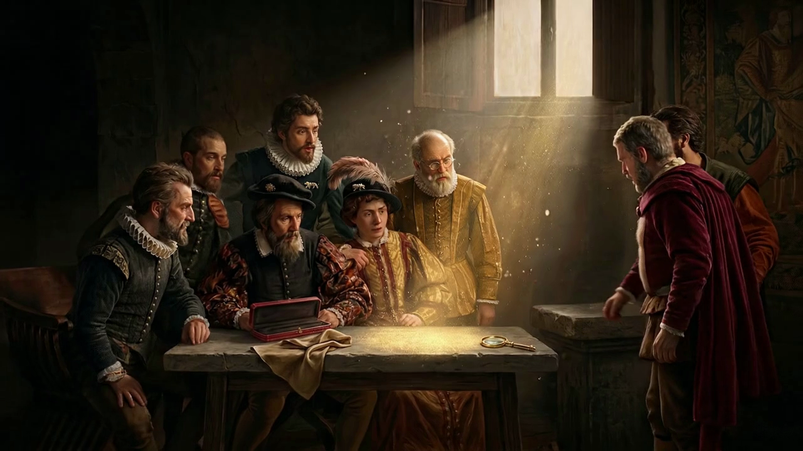
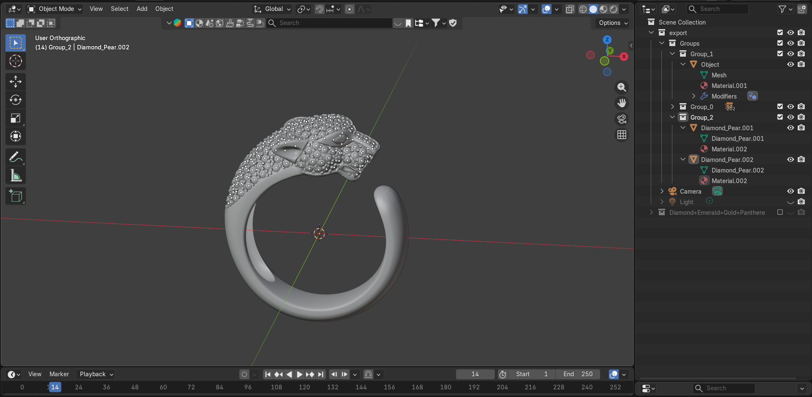

# Panthere de Cartier -- Interactive Product Experience

A scroll-driven 3D product page built around the [Panthere de Cartier ring (CRN4225000)](https://www.cartier.com/en-it/jewellery/rings/panthere-de-cartier/panthere-de-cartier-ring-medium-model-half-paved-CRN4225000). The goal was to take a real luxury product and reimagine how it could be presented online, as something closer to walking into a Cartier boutique.

Built with **Three.js** (r160, CDN) and vanilla JavaScript.

 [View the live experience](https://sajjadmazaherizaveh.it/panthere-demo)

---

## The idea

Cartier's product pages show beautiful photos, but the Panthere ring has so much detail -- 137 diamonds, emerald eyes, the panther sculpted in gold -- that photos alone don't do it justice. I wanted to build an experience where you actually *feel* the craftsmanship: watch the stones assemble one by one, rotate the ring in your hands, change the metal and see it catch the light differently.

The experience is split into narrative chapters that you scroll through, each one revealing a different aspect of the ring.

## How it works

The page is one long scroll (600vh). A progress value (0 to 1) drives everything: camera positions, 3D animations, background transitions, text reveals. Each "stage" owns a range of that progress and handles its own logic.

**Stage flow:**

1. **Loading** -- wireframe diamond draws itself line by line
2. **Painting reveal** -- a Caravaggio-inspired scene appears through a paper-tear effect
3. **Painting scrub** -- scroll controls a 24-frame video sequence frame by frame
4. **Diamond extraction** -- painting shrinks into a gilded frame, the diamond pulls forward
5. **Assembly** -- 137 diamonds multiply and settle into the ring shape
6. **Ring reveal** -- gold body rises, emerald eyes pop in with overshoot
7. **Configurator** -- choose metal, eye stones, pave style; orbit the ring freely
8. **Cinematic orbit** -- 360-degree camera sweep with gold particle burst
9. **Product card** -- final presentation with specs, pricing, and call to action

## The painting

The narrative starts with a painting. I took Caravaggio's *The Calling of Saint Matthew* as reference -- the dramatic light beam, the group around a table, the sense of a moment being revealed.

| Reference (Caravaggio) | Generated result |
|---|---|
|  |  |

Using this painting as a starting point, I generated a custom scene with [NanoBanana AI](https://nanobanana.com/) -- same composition and lighting mood, but with the characters examining a glowing jewel on the table. Then I turned that still image into a short video using Veo, exported 24 frames, and built a scroll-controlled frame scrub. As you scroll, the camera slowly pushes into the scene and the light shifts.

## The 3D ring

The ring model started as a ready-made asset. I brought it into Blender to separate the meshes (ring body, diamonds, eyes), clean up the geometry, and name everything so the code could find each part.



Materials and textures are all done in code using Three.js `MeshPhysicalMaterial`:
- **Metal** -- full metalness, brushed surface via procedural canvas texture, clearcoat for polish
- **Diamonds** -- high IOR (2.05), low roughness, specular highlights, environment map reflections
- **Eyes** -- transmission-based gems with attenuation color for depth

The configurator lets you switch between Yellow Gold, Rose Gold, White Gold, and Platinum, each with tuned PBR values. Eye stones include Emerald, Sapphire, Ruby, Amethyst, and Tsavorite.

## Technical notes

**Stack:** Three.js r160 via CDN import maps, vanilla ES modules, no bundler.

**Rendering:** Transparent WebGL canvas over HTML background layers. This lets the 3D ring float over CSS-controlled backgrounds (painting, stars, velvet, boutique) without compositing in the shader.

**Scroll system:** Custom scroll hijack locks the page during the painting scrub range so the wheel controls frame progression instead of page scroll. Outside that range, smooth lerp interpolation gives the scroll a weighted feel.

**Lighting:** Procedural PMREM environment map with multiple panel lights simulating a jewelry photography studio. 3-point directional lighting (key, fill, rim) plus a cursor-following point light for interactive highlights.

**Velvet background:** Custom GLSL vertex + fragment shader with FBM noise for procedural cloth folds. Responds to cursor position and scroll progress.

**Physics:** Diamond meshes have spring-based cursor repulsion during the assembly stage -- move your mouse near them and they scatter, then settle back.

## File structure

```
panthere-demo/
  index.html          -- markup, background layers, configurator UI
  style.css           -- all styles, animations, responsive layout
  js/
    main.js           -- orchestrator, stage functions, render loop
    scene.js           -- Three.js setup, lights, env map, particles
    ring.js            -- GLB loader, material assignment, physics
    materials.js       -- PBR configs for metals, gems, diamonds
    backgrounds.js     -- HTML background layer transitions
    scroll.js          -- scroll tracking + video hijack
    loader.js          -- wireframe diamond, draw animation
    ui.js              -- configurator buttons, product card
    stage1-painting-scrub.js -- frame sequence + shrink-to-frame
    velvet-morph-background.js -- GLSL velvet cloth shader
    paper-tear.js      -- paper tear transition effect
    utils.js           -- shared math helpers
  assets/

```

---

*Concept and development by Sajjad Mazaheri.*
